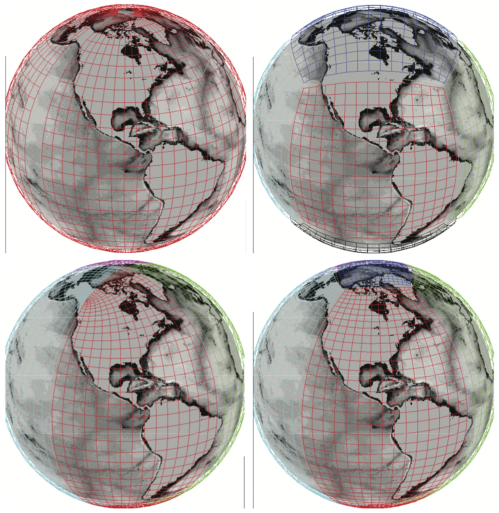

# MeshArrays.jl

[](https://juliaclimate.github.io/MeshArrays.jl/dev)
[](https://codecov.io/gh/juliaclimate/MeshArrays.jl)
[](https://github.com/juliaclimate/MeshArrays.jl/actions/workflows/ci.yml)

[](https://mybinder.org/v2/gh/JuliaClimate/MeshArrays.jl/master)
[](https://zenodo.org/badge/latestdoi/143987632)


**MeshArrays.jl** defines the `MeshArray` data structure (or type) that can contain, distribute, etc., collections of inter-connected arrays as generally done in climate models. This provides a simple yet efficient and general way to e.g. analyze climate system simulations and manipulate their output.

See the [Docs](https://juliaclimate.github.io/MeshArrays.jl/dev/) and [Tutorial](https://juliaclimate.github.io/MeshArrays.jl/dev/start/basics.html) for more detailed information.

```
struct gcmarray{T, N} <: AbstractMeshArray{T, N}
   grid::gcmgrid
   meta::varmeta
   f::Array{Array{T,2},N}
   fSize::Array{NTuple{2, Int}}
   fIndex::Array{Int,1}
   version::String
end
```

Some features and related packages:

- accurately compute planetary scale transports on a global ocean model [C-grid](https://en.wikipedia.org/wiki/Arakawa_grids)
- efficiently compute trajectories of ocean plastic, plankton, etc over any supported C-grid configuration using `MeshArrays.jl` along with [IndividualDisplacements.jl](https://github.com/JuliaClimate/IndividualDisplacements.jl)
- reading and writing files in [Netcdf](https://en.wikipedia.org/wiki/NetCDF) ([CF-compliant](http://cfconventions.org)), CSV, or binary formats often used in climate sciences. [NCTiles.jl](https://gaelforget.github.io/NCTiles.jl/stable/) readily supports domain decomposition with `MeshArray.jl`
- support for the analysis of [MITgcm](https://mitgcm.readthedocs.io/en/latest/) model ouput and optimized, [state estimate](https://doi.org/10.5194/gmd-8-3071-2015) solutions are provided via [MITgcmTools.jl](https://github.com/gaelforget/MITgcmTools.jl) and [OceanStateEstimation.jl](https://github.com/gaelforget/OceanStateEstimation.jl), with interfaces in `MeshArray.jl`

`MeshArrays.jl` was first introduced as as _gcmfaces.jl_ in [this presentation](https://youtu.be/RDxAy_zSUvg) at JuliaCon 2018.

[](https://youtu.be/RDxAy_zSUvg) 

 


