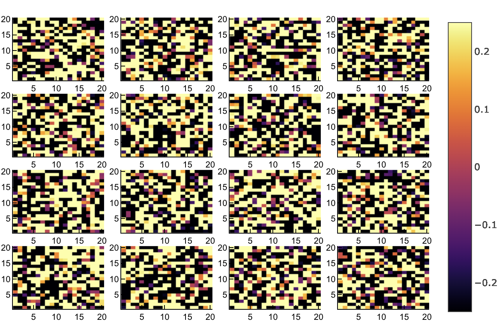
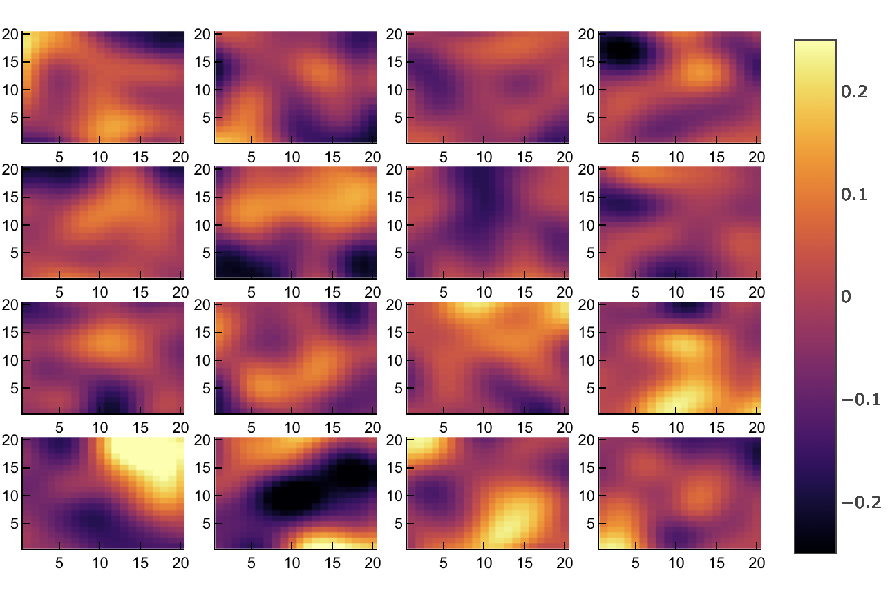

# MeshArrays.jl


[](https://travis-ci.org/juliaclimate/MeshArrays.jl)
[](https://codecov.io/gh/juliaclimate/MeshArrays.jl)
[](https://coveralls.io/github/juliaclimate/MeshArrays.jl?branch=master)

[](https://zenodo.org/badge/latestdoi/143987632)
[](https://juliaclimate.github.io/MeshArrays.jl/stable)
[](https://juliaclimate.github.io/MeshArrays.jl/dev)

`MeshArrays.jl` mainly defines an array type that can contain / organize / distribute collections of inter-connected arrays as done in climate models (see below & docs). It provides a simple but efficient and general solution to analyze and simulate climate system variables ([JuliaCon-2018 presentation](https://youtu.be/RDxAy_zSUvg)).

### Installation & Test

```
using Pkg
Pkg.add("MeshArrays")
Pkg.test("MeshArrays")
```

### Use Examples

The example below (1) generates a grid decomposition, (2) seeds random noise everywhere, (3) smoothes out the noise, and (4) plots the (`outer`) array of subdomain (`inner`) arrays. The diffusion-based smoother illustrates how `MeshArrays.jl` computes partial derivatives over the whole domain by transfering data between neighboring subdomains. 

```
using MeshArrays; p=dirname(pathof(MeshArrays))
GridVariables=GridOfOnes("PeriodicDomain",16,20)

include(joinpath(p,"../examples/Demos.jl"))
(in,out,_,_)=demo2(GridVariables);
show(out)

using Plots; plotlyjs()
include(joinpath(p,"../examples/Plots.jl"))
heatmap(out,clims=(-0.25,0.25))
```

Initial noise           |  Smoothed noise 
:------------------------------:|:---------------------------------:
  |  

Above, we used _16 subdomains_, with _40x40 grid points_ each, covering a standard _doubly periodic domain_. However, `MeshArrays` also readily supports elaborate grids commonly used in climate models, such as the ones shown below.


### Jupyter Notebooks

The [JuliaCon-2018 presentation](https://youtu.be/RDxAy_zSUvg) corresponds to two of the [Jupyter notebooks](https://en.wikipedia.org/wiki/Project_Jupyter) found in the [GlobalOceanNotebooks repo](https://github.com/gaelforget/MeshArrayNotebooks.git) under `DataStructures/`. Other notebooks in this repo demonstrate how `MeshArrays` can accurately compute planetary transports e.g. on the [Arakawa C-grid](https://en.wikipedia.org/wiki/Arakawa_grids) commonly used in climate models, as well as [Netcdf](https://en.wikipedia.org/wiki/NetCDF) support for domain decompositions.

- The [IndividualDisplacements.jl](https://github.com/gaelforget/IndividualDisplacements.jl) package (see its `examples/`) in turn computes trajectories of ocean plastic, plankton, etc over the C-grid configurations supported in `MeshArrays.jl`.
- Support for [CF-compliant](http://cfconventions.org) [Netcdf](https://en.wikipedia.org/wiki/NetCDF) input / output of `MeshArray` instances, with domain decomposition, and C-grid variables is provided via [NCTiles.jl](https://gaelforget.github.io/NCTiles.jl/stable/).
- Support for `MITgcm` use cases and specificities is provided via [MITgcmTools.jl](https://github.com/gaelforget/MITgcmTools.jl).


