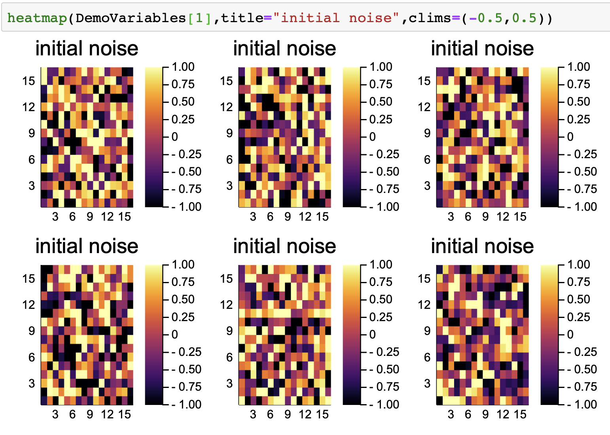
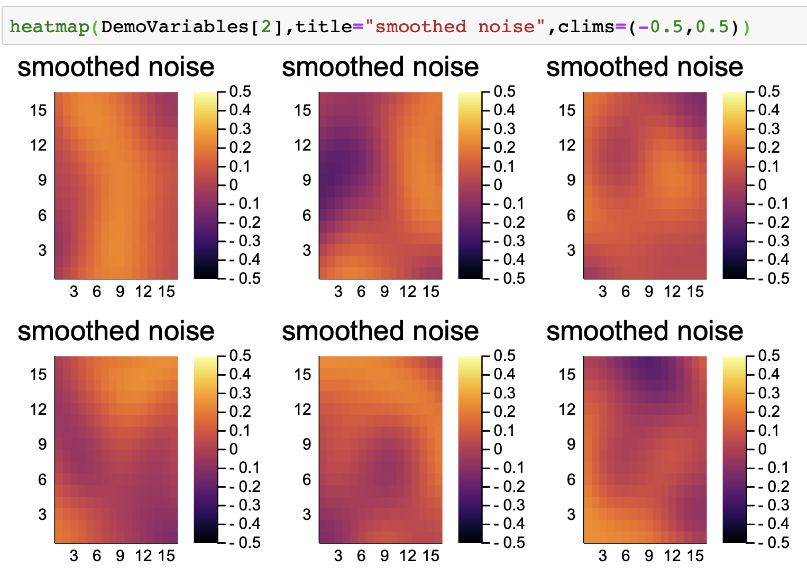

# MeshArrays.jl


[](https://travis-ci.org/juliaclimate/MeshArrays.jl)
[](https://codecov.io/gh/juliaclimate/MeshArrays.jl)
[](https://coveralls.io/github/juliaclimate/MeshArrays.jl?branch=master)

[](https://zenodo.org/badge/latestdoi/143987632)
[](https://juliaclimate.github.io/MeshArrays.jl/stable)
[](https://juliaclimate.github.io/MeshArrays.jl/dev)

`MeshArrays.jl` primarily defines composite types that embed inter-connected array collections and provides `exchange` functions that transfer data between connected arrays (see **Notebooks** below). It was originally introduced in this [JuliaCon-2018 presentation](https://youtu.be/RDxAy_zSUvg). _Note:_ `MeshArrays.jl` is registered, documented, etc., but still regarded as a **preliminary implementation**.

### Installation

```
using Pkg
Pkg.add("MeshArrays")
Pkg.test("MeshArrays")
```

### Use example

Let's integrate a diffusion equation over the surface of a simple cube. Starting from noisy `DemoVariables[1]`, this example produces smooth `DemoVariables[2]` as depicted below.

```
using MeshArrays; p=dirname(pathof(MeshArrays));

GridVariables=GridOfOnes("cs",6,100)
DemoVariables=MeshArrays.demo2(GridVariables)

using Plots; include(joinpath(p,"Plots.jl"));
heatmap(DemoVariables[1],title="initial noise",clims=(-0.5,0.5))
heatmap(DemoVariables[2],title="smoothed noise",clims=(-0.5,0.5))
```

Initial noise example           |  Smoothed noide example
:------------------------------:|:---------------------------------:
  |  

### Notebooks

The [JuliaCon-2018 presentation](https://youtu.be/RDxAy_zSUvg) relied on two `Jupyter notebooks` that are available in the [MeshArrayNotebooks repo](https://github.com/gaelforget/MeshArrayNotebooks.git). Other notebooks were later included to e.g. illustrate how the diffusion problem is used for unit testing purposes, or show how `MeshArrays` can readily be used to analyze and plot Earth System Models. All notebooks can readily be used in the cloud via `binder`.
